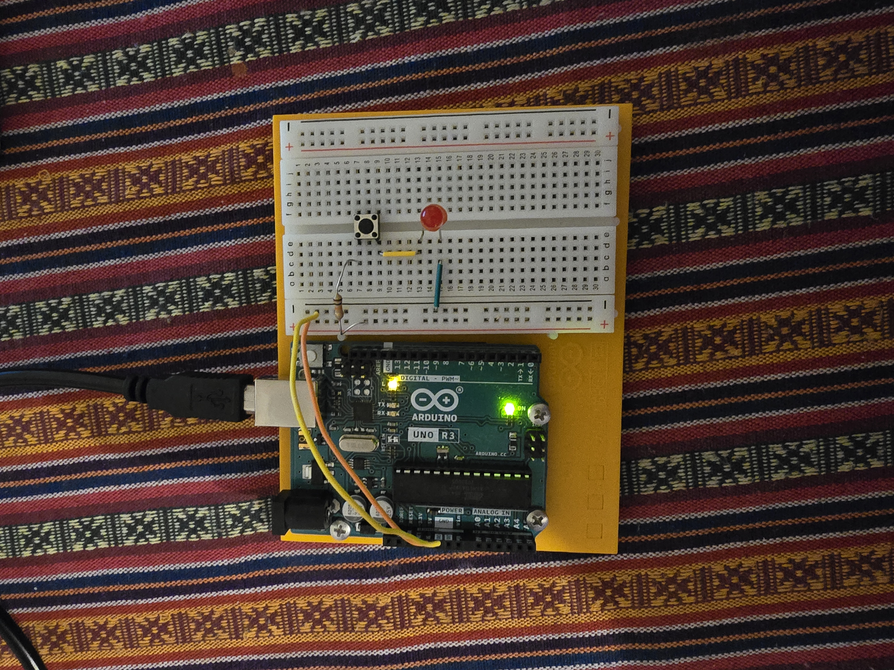
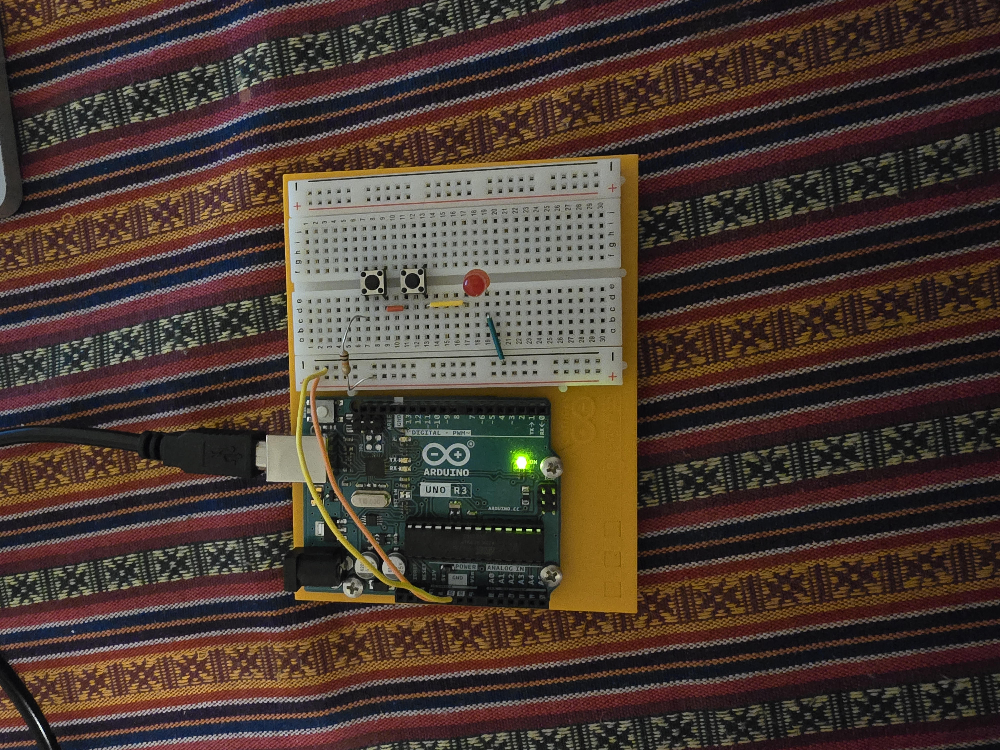
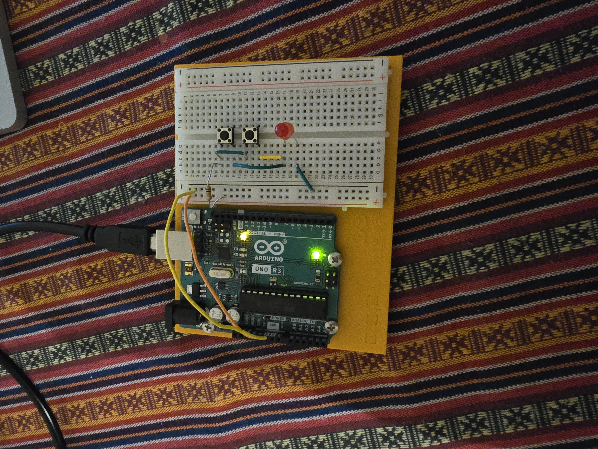

# Arduino Project 01 – Basic Circuits with LED and Switches

**Goal:**  
Refresh knowledge about current, voltage, and resistance, and get familiar with using a breadboard and the Arduino as a power source.  
This project focuses on understanding how switches affect the flow of current in series and parallel configurations.

---

## Components
- Arduino Uno (used only as 5 V power supply)
- Breadboard
- 1 LED (red)
- 1 kΩ resistor
- 2 push-button switches
- Jumper wires (orange for +5 V, yellow for GND)

---

## Circuit Parts

### 🔹 Part 1 – Single Switch
- A single switch is placed in series with the LED and resistor.  
- The LED lights up **only when the switch is pressed**, completing the circuit.

### 🔹 Part 2 – Two Switches in Series
- Two switches are connected **in series**.  
- The LED lights up **only when both switches are pressed** (logical AND behavior).  
- Demonstrates that current can only flow when both switches are closed.

### 🔹 Part 3 – Two Switches in Parallel
- Two switches are connected **in parallel**.  
- The LED lights up **if either switch is pressed** (logical OR behavior).  
- Demonstrates multiple current paths in a parallel connection.

---

## Notes
- The Arduino board was used only to provide a stable 5 V supply (no programming required).  
- The resistor limits the current to protect the LED.  
- Using a higher resistor value (1 kΩ instead of 220 Ω) makes the LED slightly dimmer but keeps it safe.  

---

## Photos
Images of the setup are provided in the `/images` folder.

```markdown




	​

